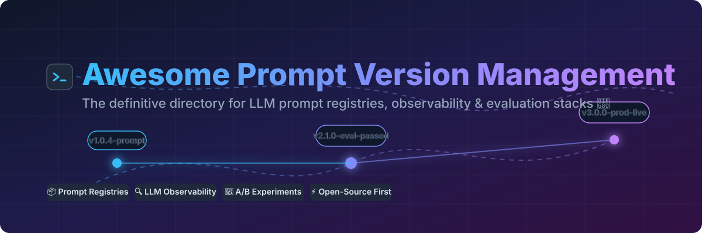

# 🚀 Awesome Prompt Version Management & LLM Observability

  

  
  
  
  

## 📌 Top Prompt Version Management Platforms & LLMOps Ecosystem
**Curated List of SaaS Products & Open-Source GitHub Projects for Prompt Engineering, Registries, Experiments & Observability.**  
*Focused on Prompt Version Control, LLM Tracing, Evaluation Frameworks, and Model Lifecycle Management.*  
📅 **Last updated: September 2026**

---

### 💡 Overview & SEO Keywords
This repository tracks leading **SaaS platforms** and **open-source tools** designed for **Prompt Version Management**, **Prompt Engineering**, and **LLM Observability**. These platforms empower AI engineers and LLMOps teams to store, version, tag, evaluate, test, and deploy production prompts for LLM applications with full visibility and governance.

**Core Capabilities Covered:**
- 🏷️ **Prompt Versioning & Registries**: Git-like prompt tagging, version history, rollback, and environment promotion (Dev / Staging / Prod).
- 🔬 **A/B Testing & Evaluation**: Prompt experimentation, dataset benchmarking, and automated LLM-as-a-judge scoring.
- 📊 **LLM Observability & Tracing**: Cost tracking, latency monitoring, error rate logging, and execution step tracing.
- 🛡️ **AI Gateways & Security**: Rate limiting, model fallback routing, compliance auditing, and guardrails.

---

## 📑 Table of Contents
- [📊 Market Landscape & Sector Analysis](#-market-landscape--sector-analysis)
- [☁️ SaaS & Hosted Platforms](#%EF%B8%8F-saas--hosted-platforms)
- [💻 Open-Source GitHub Projects](#-open-source-github-projects)
- [🛠️ How to Contribute](#%EF%B8%8F-how-to-contribute)
- [⭐ Star History](#-star-history)
- [⚠️ Disclaimer](#%EF%B8%8F-disclaimer)

---

## 📊 Market Landscape & Sector Analysis

> 📈 **Estimated Market Size**: The global **LLMOps, Prompt Management & Observability** market is estimated at **$1.8 Billion – $2.5 Billion in 2026**, projecting a CAGR of ~38% driven by enterprise LLM deployments and multi-agent system adoption.  
> 🧩 **Market Structure**: The sector is **moderately to highly fragmented** with ongoing consolidation. While commercial LLMOps platforms (such as LangSmith, Braintrust, and Portkey) compete for enterprise workloads, open-source standards (such as Langfuse and LiteLLM) hold strong community adoption. It is currently **not a winner-take-all market**, as teams frequently pair specialized prompt registries with open proxies and self-hosted evaluation stacks.

---

## ☁️ SaaS & Hosted Platforms

*(Sorted descending by Company Scale / Funding / Valuation)*

| Product & Description | Company Scale (Funding / Valuation / ARR) | Starting Paid Tier Pricing | Free Tier / Free Trial Limits |
| :--- | :--- | :--- | :--- |
| 🦜 **[LangSmith](https://www.langchain.com/langsmith)** LangChain’s platform for prompt versioning, tracing, and evaluation. | **~$1.25B Valuation** ($260M raised, ~$16M ARR) | **$39/user/month** (Plus plan) | **5,000 traces/month** free forever (1 seat, 14-day retention) |
| 🧠 **[Braintrust](https://www.braintrust.dev/)** Evaluation-first platform for prompt testing, versioning, and LLM observability. | **~$800M Valuation** ($121M raised, Series B led by ICONIQ) | **$249/month** (Pro plan) | **1 GB data & 10,000 scores/month** free ($10 model credits/month) |
| ⚡ **[Portkey](https://portkey.ai/)** AI gateway & observability platform with prompt registries, routing, and governance. | **~$140M Valuation / Acquisition target** ($18M raised, Series A led by Elevation) | **$49/month** (Production plan) | **10,000 logs/month** free forever (Developer plan, 3-day log retention) |
| 🚀 **[OpenPipe](https://openpipe.ai/)** Platform focused on LLM fine-tuning and prompt optimization (Acquired by CoreWeave). | **Acquired by CoreWeave** (Formerly venture backed, integrated with W&B) | **Usage-based starting at $0.48/1M tokens** for 8B model training | **30-day free trial period** (No permanent free tier) |
| 🛡️ **[PromptLayer](https://www.promptlayer.com/)** Prompt management platform focused on versioning, release labels, and non-tech editor collab. | **~$4.8M Funding** (Estimated $1M–$2M ARR, Seed backed) | **$49/month** (Pro plan) | **2,500 requests/month** free forever (10 playground runs/day, 10MB dataset limit) |
| 🔥 **[Langfuse](https://www.langfuse.com/)** Leading open-source LLM observability and prompt management platform (Acquired by ClickHouse). | **Acquired by ClickHouse** ($4.5M raised prior to acquisition, YC W23) | **$29/month** (Core plan, 100k units included) | **50,000 billable units/month** free forever (Hobby tier, 30-day retention) |
| 📊 **[Helicone](https://www.helicone.ai/)** LLM observability proxy with prompt logging, versioning, and cost analytics. | **~$25M Valuation** ($5M Seed, ~$1M ARR, YC backed) | **$79/month** (Pro plan, includes 10k requests) | **10,000 requests/month** free forever (Hobby tier, 1 GB storage) |
| 🌙 **[Lunary](https://www.lunary.ai/)** Open-source LLM observability & prompt tracking platform. | **Bootstrapped / Seed** (Early stage LLMOps startup) | **$20/user/month** (Team plan) | **1,000 events/day** free forever (Hobby cloud tier; unlimited self-hosted) |
| ⚙️ **[PromptHub](https://www.prompthub.us/)** Prompt management registry focused on sharing, versioning, and prompt discovery. | **Bootstrapped / Seed** (Independent developer tooling) | **$12/month** (Pro plan for private prompts) | **2,000 requests/month** free forever (Public prompts only, unlimited seats) |
| 🔁 **[Humanloop](https://humanloop.com/)** Prompt engineering and evaluation platform (Acquired by Anthropic). | **Acquired by Anthropic** (Former YC backed startup, in sunset transition) | **Custom enterprise quotes** | **14-day free trial** (2 members, 50 eval runs, 10,000 logs/month) |

---

## 💻 Open-Source GitHub Projects

*(Sorted descending by GitHub Star Count ⭐)*

- 🔌 **[LiteLLM](https://github.com/BerriAI/litellm)**   
  Universal I/O proxy for 100+ LLMs with prompt management, load balancing, fallback routing, and cost tracking.

- 🔥 **[Langfuse](https://github.com/langfuse/langfuse)**   
  Leading open-source LLM engineering platform (MIT) with first-class prompt version control, release labels, tracing, and automated evaluations. Fully self-hostable.

- 🧪 **[Promptfoo](https://github.com/promptfoo/promptfoo)**   
  Open-source CLI & library for evaluating prompt quality, red-teaming LLMs, securing outputs, and versioning test cases.

- 🌊 **[Promptflow](https://github.com/microsoft/promptflow)**   
  Microsoft's suite of development tools to streamline the end-to-end prompt engineering lifecycle from prototyping to production deployment.

- 🦅 **[Arize Phoenix](https://github.com/Arize-ai/phoenix)**   
  AI observability & evaluation library for prompt tracking, RAG troubleshooting, and evaluation of LLM applications.

- 🔭 **[OpenLLMetry](https://github.com/traceloop/openllmetry)**   
  OpenTelemetry-based framework for tracing and monitoring LLM prompts, vectors, and model performance.

- 📊 **[Helicone](https://github.com/Helicone/helicone)**   
  Open-source LLM observability proxy providing real-time logging, prompt metrics, and analytics.

- 🤖 **[Agenta](https://github.com/Agenta-AI/agenta)**   
  Developer-first open-source LLMOps platform focused on prompt experimentation, evaluation, versioning, and non-coder collaboration.

---

### 💡 Open-Source Architecture Workflows
- **Full-Stack Managed Open-Source**: Deploy **Langfuse** (self-hosted Docker/K8s) → store & version prompts with labels (`production`, `staging`) → link prompts to execution traces and evaluation datasets.
- **Proxy & Gateway Stack**: Use **LiteLLM** or **Helicone** in front of OpenAI / Anthropic / Local models → capture prompts, latency, and costs → enforce fallbacks and rate limits.
- **Testing & Security**: Integrate **Promptfoo** into GitHub Actions CI/CD → run regression tests on modified prompts before merging into production.

---

## 🛠️ How to Contribute
1. Fork this repository.
2. Edit `README.md` to add or update entry details.
3. Ensure entries are relevant to prompt versioning, registries, or LLM observability.
4. Open a Pull Request with a short summary of changes.

---

## ⭐ Star History

---

## ⚠️ Disclaimer
- This repository is a **community-curated** list for informational and educational purposes.
- Prompt management tools store critical application logic and customer interactions. Always evaluate security, compliance, and privacy controls before deploying tools in production.

---

  <b>Built for AI Engineers, Prompt Engineers, and LLMOps Teams worldwide.</b>

